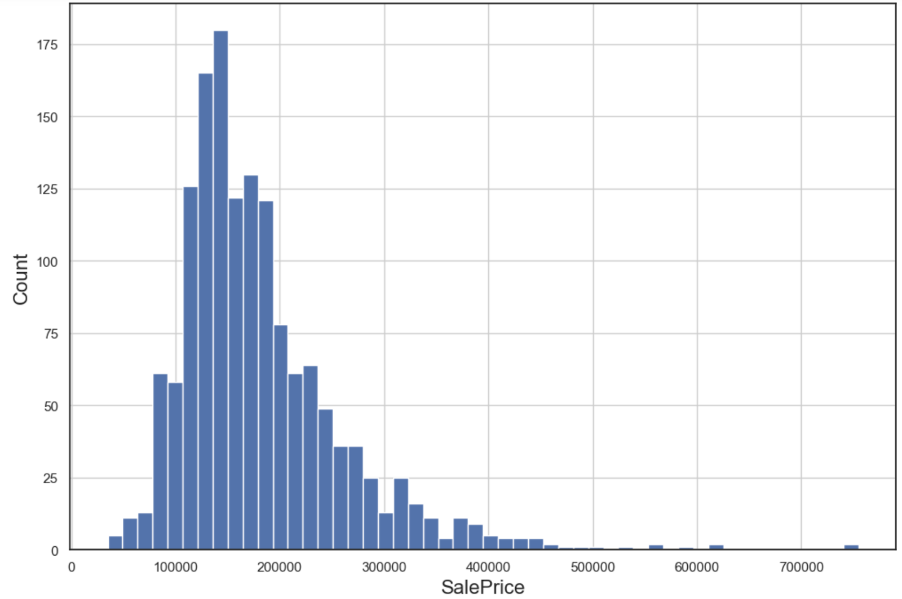

# house-prices-advanced-regression-techniques

## Index
1. [Introduction](#introduction)
2. [Exploratory Data Analysis (EDA)](#exploratory-data-analysis-eda)
3. [Data Encoding](#data-encoding)
4. [Feature Selection](#feature-selection)
5. [Model Building](#model-building)
6. [Results](#results)

## 1. Introduction

The dataset provided dives deep into the residential housing landscape of Ames, Iowa. With 79 insightful variables on offer, it paints a detailed picture of almost every facet of residential homes. The primary objective of this project is to harness these features to predict the sales prices of the houses. Such prediction tasks not only hold academic interest but also have significant real-world implications, aiding both sellers in setting competitive prices and buyers in making informed decisions.

## 2. Exploratory Data Analysis (EDA)

### Sale Price Distribution:
Our primary target variable, `SalePrice`, showcases a slightly right-skewed distribution, as visualized in:

This right_skewed shape indicates that many houses are clustered around the median price with only a few sell for considerably higher prices. Fortunately, the distribution doesn't reveal significant outliers, which means our models won't be unduly influenced by extreme values—leading to a more generalized and reliable prediction.

### Missing Data Insights:
The patterns of missing data across features are captured vividly in the two plots:

A deeper look into these visualizations reveals:

- Only a handful of features have significant missing data (above 15%). It's a logical choice to exclude these from our analysis to maintain data quality.
  
- Interestingly, most of the missing values aren't randomly spread across the dataset. They're concentrated in specific rows, indicating potential issues in the data collection or entry process for those records. Given this pattern, it's prudent to remove such rows to ensure the robustness of our predictive models.

Through EDA, we gain valuable insights into the data's characteristics and challenges, guiding our subsequent preprocessing steps.
