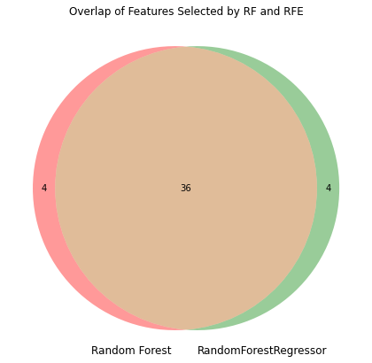

# house-prices-advanced-regression-techniques 🏠

## Index
1. [Introduction](#1-introduction)
2. [Exploratory Data Analysis (EDA)](#2-exploratory-data-analysis-eda)
3. [Data Encoding](#3-data-encoding)
4. [Feature Selection](#4-feature-selection)
5. [Model Building and Evaluation](#5-model-building-and-evaluation)
6. [Conclusion](#6-conclusion)

## 1. Introduction

The dataset provided dives deep into the residential housing landscape of Ames, Iowa. With 79 insightful variables on offer, it paints a detailed picture of almost every facet of residential homes. The primary objective of this project is to harness these features to predict the sales prices of the houses. Such prediction tasks not only hold academic interest but also have significant real-world implications, aiding both sellers in setting competitive prices and buyers in making informed decisions.

## 2. Exploratory Data Analysis (EDA)

### Sale Price Distribution:
Our primary target variable, `SalePrice`, showcases a slightly right-skewed distribution, as visualized in:

This right_skewed shape indicates that many houses are clustered around the median price with only a few sell for considerably higher prices. Fortunately, the distribution doesn't reveal significant outliers, which means our models won't be unduly influenced by extreme values—leading to a more generalized and reliable prediction.

### Missing Data Insights:
The patterns of missing data across features are captured vividly in the two plots:

A deeper look into these visualizations reveals:

- Only a handful of features have significant missing data (above 15%). It's a logical choice to exclude these from our analysis to maintain data quality.
  
- Interestingly, most of the missing values aren't randomly spread across the dataset. They're concentrated in specific rows, indicating potential issues in the data collection or entry process for those records. Given this pattern, it's prudent to remove such rows to ensure the robustness of our predictive models.

Through EDA, we gain valuable insights into the data's characteristics and challenges, guiding our subsequent preprocessing steps.

## 3. Data Encoding

Handling categorical data is crucial in this dataset, especially considering the split of numeric to categorical features is 36:33, indicating a significant portion is categorical. In many machine learning models, such categorical data can't be ingested in its raw form and needs transformation to a numerical format. For this dataset, I've chosen an advanced encoding technique.

### Median Encoding:

Instead of employing the traditional one-hot or label encoding, I encoded each category with the median of the `SalePrice` associated with it. This method allows for capturing the intrinsic relationship a categorical variable might have with the target variable, `SalePrice`.

### Smoothed Median Encoding:

Direct median encoding can sometimes lead to overfitting, particularly when a category doesn't appear frequently in the dataset. To address this, I incorporated smoothed median encoding. The principle is straightforward:

$$ \text{Smoothed Value} = \frac{n \times \text{Category Median} + m \times \text{Overall Median}}{n + m} $$

Where:
- \( n \) is the number of times the category appears.
- \( m \) is a smoothing parameter.

### Adding Random Noise:

To provide an additional layer against overfitting and to make the encoding less deterministic, I introduced random noise to the encoded values, adjusting each value by a factor within the range of ±5% of its original value. This ensures the encoded values, while indicative of their association with the sale price, aren't a perfect match, offering more generalization in models.

By using this approach, I aim to capture the nuances within the categorical data while molding them for improved model predictions.

## 4. Feature Selection

Feature selection is a critical step in any machine learning project. Choosing the right subset of features can lead to simpler, more interpretable, and often more accurate models. In the context of this housing dataset, with its rich set of 79 variables, the challenge was to distill the essence of the data while discarding redundant or irrelevant information.

We employed a two-pronged strategy for feature selection:

### 1. **Feature Importance using Random Forests**:
Random Forests can rank features based on their importance in predicting the target variable. By training a Random Forest on our data and examining the importance of each feature, we identified those features that had the most impact on predicting house prices.

### 2. **Recursive Feature Elimination (RFE) with Gradient Boosting Machine (GBM)**:
RFE is a method that fits the model repeatedly on iterative subsets of features. At each iteration, it discards the least important feature until the desired number of features is reached. For this, we used the powerful GBM as our estimator. GBM, being a gradient boosting method, builds the model in a stage-wise fashion optimizing for accuracy, which makes it an excellent choice for RFE.

Combining the results from both methods, we found a significant overlap in the features (36 out of 40) they deemed important. This provided us with a robust, reliable set of 36 features that were used for building our final predictive model. The harmony between the two feature selection methods boosted our confidence in the selected subset.

 

This synergy in feature selection ensured that we captured the most relevant aspects of the data while keeping the model complexity in check.

## 5. Model Building and Evaluation

After encoding and feature selection, I delved into building models to predict house prices. I explored three regression models: Random Forest, SVM, and Gradient Boosting Regression. Below are the performances of these models:

| Model                     | Train RMSLE | Prediction RMSLE |
|---------------------------|-------------|------------------|
| Random Forest             | 0.14403     | 0.15649          |
| SVM                       | 0.41367     | 0.41631          |
| Gradient Boosting Regression | 0.14558 | 0.14172      |

**Model Analysis:**
- **Gradient Boosting Regression (GBR)** proved to be the most effective. Its strength lies in its resilience to outliers, and it performs optimally on small to medium-sized datasets. Given our dataset dimensions of approximately 1500x36, this model is well-suited.
- **Random Forest** performed admirably on the training data, but there's evidence of slight overfitting when it's applied to new, unseen data. 
- **Support Vector Machines (SVM)** didn't fare as well, likely due to its hyper-parameter sensitivity. Given the dataset's size and SVM's nature, it was not the optimal choice for this task.

**Grid Search and Final Model Selection:**

To further refine the model's performance, I employed grid search for hyperparameter tuning, particularly for the Gradient Boosting Regression model. The final parameters chosen were:

GradientBoostingRegressor(learning_rate=0.05, max_depth=4, max_features='sqrt', n_estimators=300, random_state=42, subsample=0.8)

These parameters were selected after an exhaustive search, ensuring that the model not only fits the training data well but also generalizes effectively to unseen data. The model's robustness and ability to handle outliers make it the ideal choice for this dataset.

## 6. Conclusion

After conducting a comprehensive analysis of the Ames Housing dataset, I successfully built a model capable of predicting house prices with an RMSLE of 0.14172 on the test dataset. This project highlighted the importance of data preprocessing, exploratory data analysis, and the selection of the right machine learning model. Gradient Boosting Regression, with its ability to be robust to outliers and handle datasets of this size effectively, proved to be the most effective model among the ones tested.

### Adaptation to Underfitting and Overfitting
The closely matched RMSLE values between the training model and the actual test dataset indicate that our model does not suffer from overfitting or underfitting. Several reasons contribute to this balanced performance:

1. **Normal Distribution of Sale Price**: The Sale Price follows a near-normal distribution. This ensures that the model isn't biased towards prices too distant from the mean.
2. **Optimal Model Complexity**: The use of feature selection to choose 36 significant features seems to strike an appropriate balance between accuracy and model complexity.
3. **Cross-Validation Strategy**: Employing a 5-fold cross-validation approach ensures that outliers or anomalous data points don't disproportionately influence the model's performance.

Future work could involve experimenting with more advanced models, additional feature engineering, or employing deep learning techniques to further improve the prediction accuracy. Additionally, external datasets could be integrated to include factors like economic indicators or neighborhood development indexes, which might influence housing prices.

## Tools & Libraries

This project was implemented using Python and its rich ecosystem of data science libraries. The primary tools and libraries used include:

- **Pandas**: For data manipulation and analysis.
- **NumPy**: For numerical operations.
- **Scikit-learn**: For building and evaluating machine learning models.
- **Seaborn & Matplotlib**: For data visualization.
